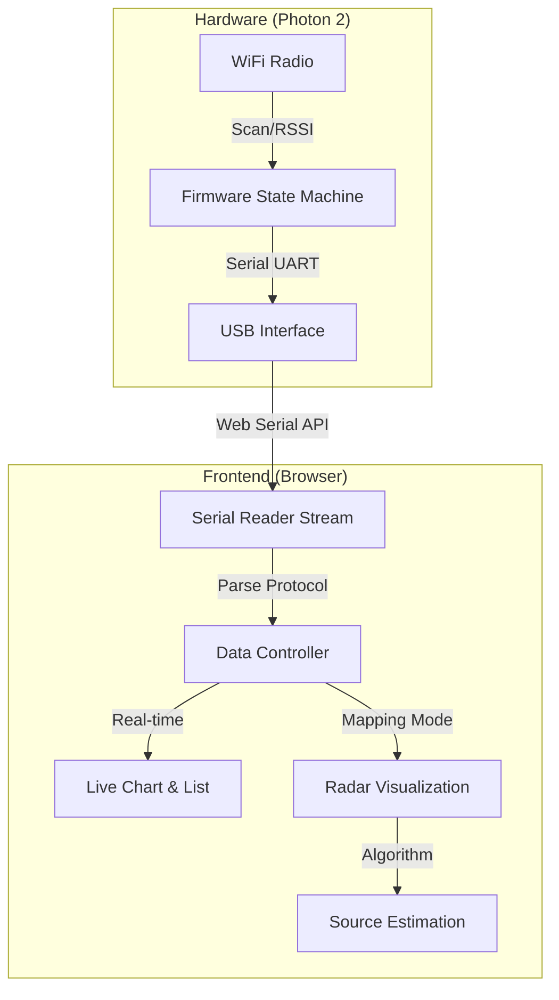
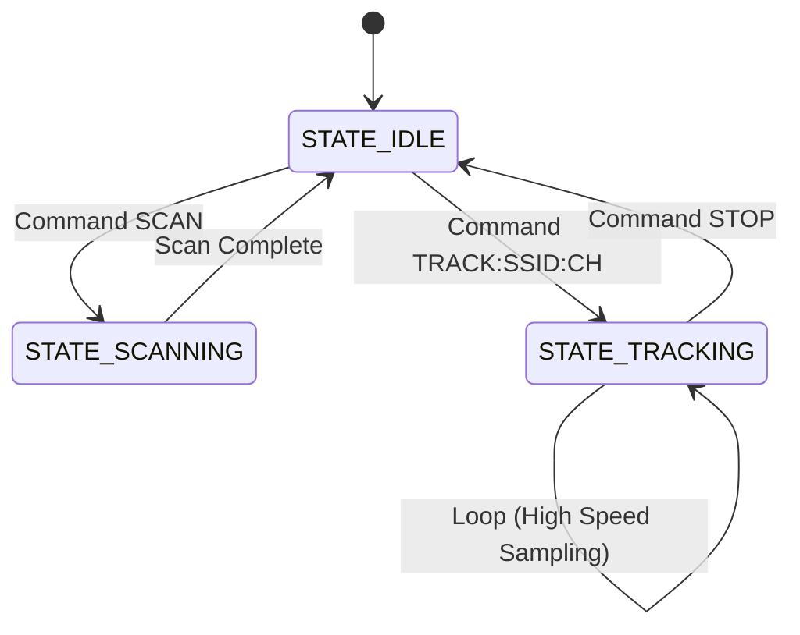

# Photon 2 Wi-Fi Signal Mapper v0.0

**Demo:** https://xzg3417.github.io/EE1301_Project_Standalone/web_interface


## 1. Project Overview

This project is a semi-automated IoT tool designed to visualize the invisible landscape of Wi-Fi signals. By combining a **Particle Photon 2** hardware scanner with a sophisticated **Web Serial** frontend, the system allows users to perform directional signal mapping, track specific networks in real-time, and mathematically estimate the physical location of a signal source.

Unlike standard Wi-Fi scanners that simply list available networks, Signal Hunter treats signal strength (RSSI) as a vector quantity (magnitude and direction), enabling a "Radar" visualization approach.


## 2. System Architecture

**Device**: Photon 2 (Device OS 6.3.3)

The system operates on a Host-Client architecture where the Particle Photon 2 acts as the raw data acquisition client, and the Browser acts as the processing host.



### 2.1 Hardware Implementation (C++)

The firmware (`project.cpp`) utilizes a non-blocking **Finite State Machine (FSM)** to manage radio resources. This ensures the device remains responsive to serial commands even while performing heavy scanning operations.

*   **Idle State:** Waits for serial input.
*   **Scanning State:** Executes `WiFi.scan()` to retrieve a full list of APs (SSID, RSSI, Channel, Security).
*   **Tracking State:** Locks onto a specific target (SSID + Channel) and samples RSSI at the maximum refresh rate allowed by the hardware (~10-20Hz).

### 2.2 Serial Communication Protocol

To ensure data integrity over the USB serial link, a custom ASCII-based protocol was designed:

| Direction    | Command / Prefix | Arguments             | Description                      |
| :----------- | :--------------- | :-------------------- | :------------------------------- |
| **TX (Web)** | `SCAN`           | None                  | Triggers full spectrum scan.     |
| **TX (Web)** | `TRACK`          | `SSID:CH`             | Locks tracking to specific AP.   |
| **RX (Dev)** | `LIST:`          | `SSID,RSSI,CH...`     | Returns scan results.            |
| **RX (Dev)** | `DATA:`          | `RSSI,CH,BSSID`       | Returns real-time tracking data. |
| **RX (Dev)** | `STATUS:`        | `DEVICE:CONNECTED...` | Heartbeat & IP info.             |

## 3. Algorithm Implementation Details

The core innovation of this project is the **Source Direction Estimation**. Since the Particle Photon 2 utilizes an omnidirectional antenna, directionality is achieved through "Manual Sweeping"—the user rotates the device (or a directional shield) and records RSSI at specific angles.

The system uses a **Weighted Vector Sum** algorithm to predict the source angle.

### 3.1 RSSI to Weight Conversion

Raw RSSI is logarithmic ($dBm$). To perform vector addition, we convert this to a linear magnitude ($w$) representing approximate signal amplitude. We apply an offset ($+100$) to normalize the typical Wi-Fi floor.

$$
w = 10^{\frac{RSSI + 100}{20}}
$$

### 3.2 Vector Decomposition

For every measurement point $i$ consisting of an angle $\theta_i$ and signal strength $RSSI_i$, we calculate the Cartesian components. Note that the UI treats $0^\circ$ as North, requiring a coordinate shift relative to standard trigonometric circles.

$$
\theta'_{i} = (\theta_i - 90) \cdot \frac{\pi}{180}
$$

$$
x_{total} = \sum_{i=1}^{n} (w_i \cdot \cos(\theta'_i))
$$

$$
y_{total} = \sum_{i=1}^{n} (w_i \cdot \sin(\theta'_i))
$$

### 3.3 Resultant Calculation
The estimated source direction $\theta_{est}$ is the angle of the resultant vector formed by summing all weighted measurement vectors.

$$
\theta_{est} = \text{atan2}(y_{total}, x_{total}) \cdot \frac{180}{\pi} + 90
$$

The final angle is normalized to the $[0, 360)$ range.

## 4. User Interface & Interaction Design

To ensure the system is usable in real-world field testing, the WebUI was designed with a focus on **high-contrast data visualization** and **tactile input simulation**. The interface allows for precise control over the hardware without requiring text-based commands.

### 4.1 The "Magnetic" Control Dial

The centerpiece of the Manual Mapping interface is a custom-built **Direction Dial**. Unlike standard HTML range sliders, this component emulates a physical rotary switch with "detents" (mechanical click-stops).

**Implementation Logic: Logic-Driven vs. Style-Driven**
The "snapping" effect is achieved entirely through **JavaScript Logic (Imperative)**, not CSS Styles (Declarative).

*   **CSS Role:** Handles the visual theme (gradients, shadows, neon glow effects) and responsive sizing.
*   **JS Role:** Handles the physics. It calculates the angle of the mouse relative to the center, applies a mathematical quantization function, and forces the UI to render only at specific intervals.

This approach ensures that the data collected is always aligned to the 16 cardinal directions (N, NNE, NE, etc.), which is critical for the consistency of the radar algorithm.

### 4.2 Interaction Event Loop

The interaction follows a "Calculate-Quantize-Render" loop, ensuring the UI feels responsive (60 FPS) while strictly enforcing data constraints.


### 4.3 Visual Feedback Mechanisms

*   **Real-time Plotting:** The Live Chart uses a FIFO (First-In-First-Out) buffer to render signal history, giving immediate visual feedback on signal stability.
*   **Radar Heatmap:** The radar chart uses transparency layers (`rgba`) to build up intensity. Overlapping measurements naturally create "hotspots," visually reinforcing the estimated source direction.

## 5. Code Design & Quality

This section details the software architecture, design patterns, and specific technical implementations used in both the firmware and the web interface. The system is designed to be **modular**, **event-driven**, and **robust**.

### 5.1 Frontend Architecture
The web interface is built without heavy external frameworks to maintain high performance for real-time serial parsing.

*   **`script.js`**:
    *   **Serial Management:** Uses the native `navigator.serial` API with `TextDecoderStream` for handling incoming line-break delimited data.
    *   **Canvas Rendering:** The Radar (`drawRadar`) and Dial (`drawDial`) are rendered on HTML5 Canvases using the 2D Context API. This allows for smooth, lag-free animations during window resizing or rapid data updates.
    *   **Data Structure:** Mapping data is stored in an array of objects: `{ id: 1, angle: 45, rssi: -60, rawSamples: [...] }`, allowing for "Undo" functionality and CSV export.
*   **`style.css`**:
    *   Implements a responsive Flexbox layout.
    *   Includes a fully responsive Dark/Light mode theme system using CSS variables for grid lines and text colors.

### 5.2 Firmware Design: Finite State Machine (FSM)
The Particle Photon 2 firmware is not designed as a linear script but as a **Finite State Machine**. This design ensures the device is always responsive to new serial commands, even when switching between modes.

*   **Logic:** The `loop()` function checks `currentState` every cycle.
*   **Non-Blocking Serial:** Incoming serial data is handled immediately at the start of `loop()`, allowing the user to send `STOP` even while the device is in `STATE_TRACKING`.



### 5.3 Web Serial Implementation: The Pipeline Pattern
A critical challenge in Web Serial is that data arrives in "chunks" that do not strictly align with line breaks. A chunk might contain `DATA:-60,1` (incomplete). To solve this, I implemented a **Stream Pipeline** pattern in `script.js`:

1.  **Hardware Stream:** Raw bytes from USB.
2.  **TextDecoder:** Converts bytes to UTF-8 strings.
3.  **Line Buffer:** Accumulates strings until a newline character (`\n`) is found.
4.  **Parser:** Validates the line and routes it to the UI.

### 5.4 WebUI Technical Implementation
The frontend uses **Vanilla JavaScript** with direct DOM manipulation to achieve the "Magnetic" feel of the dial logic described in Section 4.

**Angle Snapping Code Snippet:**

```javascript
// Calculate raw angle using Arctangent
let rad = Math.atan2(mouseY - center_Y, mouseX - center_X);
let deg = rad * (180 / Math.PI) + 90; 
if (deg < 0) deg += 360;

// Apply Snapping (Quantization) to nearest 22.5 degrees
const SNAP_STEP = 22.5;
dialAngle = Math.round(deg / SNAP_STEP) * SNAP_STEP;
```

**Canvas Optimization:**
The Radar and Dial use the HTML5 Canvas API in an "Immediate Mode" rendering pattern. The drawing functions (`drawRadar`, `drawDial`) are stateless and redraw the entire frame whenever state changes, avoiding the complexity of managing DOM elements for every data point.

### 5.5 Data Integrity
The application includes features to ensure data quality:
1.  **Filtering:** Logic to ignore signals weaker than -100dBm during vector calculation to prevent noise skewing.
2.  **Sampling Averaging:** The `measureBtn` handler aggregates `N` samples and calculates the arithmetic mean before saving a data point, acting as a low-pass filter against signal fluctuation.

## 6. Hardware Setup

The project is designed to be minimal and portable.

*   **Core Component:** Particle Photon 2.
*   **Connection:** Micro-USB cable to Host PC/Laptop.
*   **Optional Directional Shield:** To improve the accuracy of the "Manual Sweeping" process, a simple parabolic reflector (aluminum foil curved behind the antenna) can be used to create physical directionality.
*   **Optional Physical Button:** A physical button can be used on D3 for better efficiency. It uses `INPUT_PULLDOWN` and detects a `HIGH` signal. When it detects a click it performs a scan using the current parameters. After the scan is complete it passes the data to the WebUI and automatically increase the angle on the dial by 22.5 degrees.

## 7. Setup & Usage

1.  **Hardware:** Connect Particle Photon 2 via USB. Flash the `project.cpp` firmware using Particle Workbench.
2.  **Software:** Open `index.html` in a Chrome/Edge browser (Web Serial support required).
3.  **Operation:**
    *   Click **CONNECT SERIAL** and select the Photon device.
    *   Wait for the system to `SCAN`. Select a network from the left list.
    *   Switch to **MANUAL MAPPING** tab.
    *   Rotate device to a direction (e.g., North), adjust the UI Dial to match, and click **MEASURE**. 
    *   Repeat for multiple angles (East, South, West).
    *   Click **CALC SOURCE** to visualize the estimated vector arrow.
