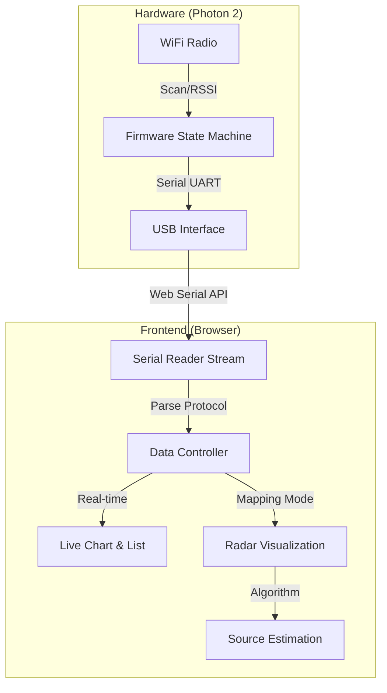
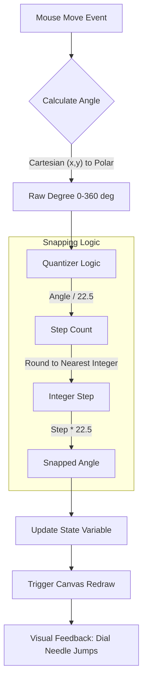
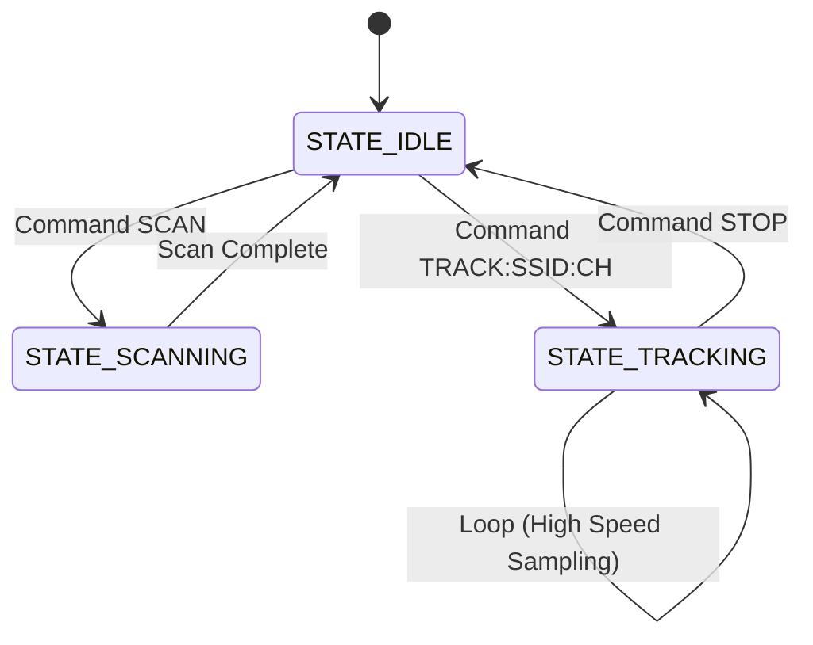

<style>
@media print {
    .md-diagram-panel {
        width: auto !important; 
        display: flex !important;
        justify-content: center !important;
    }
    .md-diagram-panel svg {  
        max-height: 600px !important; 
        width: auto !important; 
    }
}
</style>


<div align="center" style="margin-top: 250px;"> <h1 style="font-size: 3.5em; line-height: 1.2; margin-bottom: 20px;">EE1301 Final Project Report
<h1 align="center">Photon 2 Wi-Fi Signal Mapper</h1>

<p style="font-size: 1.3em;" align="center"> <strong>Team Member(s):</strong> Justin Xu (xu001495@umn.edu) </p>

<p style="font-size: 1.3em;" align="center"> <strong>Due Date:</strong> December 9, 2025 </p> 

<p style="font-size: 1em;" align="center"> <strong>Github:</strong> https://github.com/xzg3417/EE1301_Project_Standalone </p>
</div> <div style="page-break-after: always;"></div>


## 1. Project Description

### 1.1 Problem Addressed

This project addresses the limited network diagnostic capabilities of the standalone Particle Photon 2 by providing a streamlined, GUI-based tool that visualizes Wi-Fi signal strength, significantly simplifying connectivity troubleshooting compared to traditional text-based debugging. It can perform basic tests to a internal/external antenna, or impacting factors such as product enclosure.

> This project was designed to utilize a stepper motor for automated scanning. However, due to several reasons, the original design could not be executed. Fortunately, simple modifications are sufficient to enable fully automated scanning. Details will be addressed in the reflection section at the end of this report.

Wi-Fi signals are an invisible yet essential part of modern infrastructure. While standard Wi-Fi scanners can list available networks and their signal strengths, they lack spatial awareness. They provide a simple list, failing to answer the critical questions: "Where is the signal coming from?" and "How is the signal propagating through the space?"

**Photon 2 Wi-Fi Signal Mapper ** addresses this limitation by visualizing the invisible landscape of Wi-Fi signals. It treats signal strength (RSSI) not just as a number, but as a vector quantity (magnitude and direction), enabling a "Radar-style" visualization approach to locate network sources.

### 1.2 Background
To understand the necessity of this diagnostic tool, it is essential to review the principles of **Received Signal Strength Indicator (RSSI)** and **Link Budget analysis** in embedded systems. RSSI is a measurement of the power present in a received radio signal, typically expressed in decibels-milliwatts (dBm). For IoT devices like the Photon 2, signal integrity is not static; it is heavily influenced by the **RF Link Budget**, which accounts for all gains and losses from the transmitter to the receiver.

A critical factor in this budget is the physical integration of the device. When an IoT module is placed inside a product enclosure, the casing material (plastic, metal, or glass) acts as a dielectric that can detune the antenna or attenuate the signal—a phenomenon known as **enclosure de-tuning** or **insertion loss**. Furthermore, the choice between an internal PCB antenna (compact but prone to interference) and an external dipole antenna (higher gain but bulky) significantly alters the device's radiation pattern. This project provides the necessary feedback loop to visualize these impacts empirically, allowing developers to quantify the "penalty" of a specific enclosure or the "gain" of an external antenna in real-world environments.

### 1.3 Related Work

Signal testing and RF validation are established practices in the telecommunications industry, typically performed using tools that range from enterprise software to high-end laboratory hardware.

- **Professional OTA Testing (Anechoic Chambers):** In high-level industrial applications, verifying an embedded device's antenna performance and enclosure impact is performed via **Over-The-Air (OTA)** testing in an anechoic chamber using Vector Network Analyzers (VNA) from manufacturers like **Rohde & Schwarz** or **Keysight**. While these setups provide precise 3D radiation patterns, they are prohibitively expensive and immobile. This project offers a "pre-compliance" style alternative, allowing developers to perform approximate comparative testing of enclosures on a desktop without renting a lab.

- **Enterprise Site Survey Tools:** Software solutions such as **Ekahau AI Pro** or **NetAlly AirMagnet** are the industry standard for Wi-Fi mapping. These tools use specialized hardware (e.g., the Ekahau Sidekick) to map facility-wide coverage.
     However, they are designed for IT network administrators to optimize building infrastructure (Access Points), not for firmware engineers to debug the *client device's* reception performance.

- **Vendor-Specific RF Tools:** Chip manufacturers often provide proprietary tools, such as the **Espressif RF Test Tool** or **TI SmartRF Studio**. While effective, these are often restricted to specific chipsets, require heavy driver installation, and lack intuitive visualizations. By contrast, this project utilizes the modern **Web Serial API** to create a driverless, cross-platform diagnostic interface that focuses specifically on the *application-layer* connectivity experience of the Photon 2.

### 1.4 Solution Overview

> Screenshots attached in `3. Results and Reflection` section of this document.

#### System Architecture

**Device**: Photon 2 (Device OS 6.3.3)

The system operates on a Host-Client architecture where the Particle Photon 2 acts as the raw data acquisition client, and the Browser acts as the processing host.



#### Hardware Implementation (Firmware)

The firmware (`project.cpp`) utilizes a non-blocking **Finite State Machine (FSM)** to manage radio resources. This ensures the device remains responsive to serial commands even while performing heavy scanning operations.

*   **Idle State:** Waits for serial input.
*   **Scanning State:** Executes `WiFi.scan()` to retrieve a full list of APs (SSID, RSSI, Channel, Security).
*   **Tracking State:** Locks onto a specific target (SSID + Channel) and samples RSSI at the maximum refresh rate allowed by the hardware (~10-20Hz).

#### Software Implementation (GUI)

@jules 补全这一部分 关于webui前端以及后端

##### Serial Communication Protocol

To ensure data integrity over the USB serial link, a custom ASCII-based protocol was designed:

| Direction    | Command / Prefix | Arguments             | Description                      |
| :----------- | :--------------- | :-------------------- | :------------------------------- |
| **TX (Web)** | `SCAN`           | None                  | Triggers full spectrum scan.     |
| **TX (Web)** | `TRACK`          | `SSID:CH`             | Locks tracking to specific AP.   |
| **RX (Dev)** | `LIST:`          | `SSID,RSSI,CH...`     | Returns scan results.            |
| **RX (Dev)** | `DATA:`          | `RSSI,CH,BSSID`       | Returns real-time tracking data. |
| **RX (Dev)** | `STATUS:`        | `DEVICE:CONNECTED...` | Heartbeat & IP info.             |

### 1.5 Components

The project consists of the following key components:

1. **Hardware (Sensors & Connectivity):**

   > Optional components are used and tested to function correctly. 
   >
   > However, they are not the nessesary parts.

   * **Particle Photon 2:** Used as the primary Wi-Fi radio sensor. It leverages the Broadcom Wi-Fi module to perform active scanning and RSSI measurement.
   * **USB Serial Interface:** Provides a reliable, low-latency link between the hardware and the web host, eliminating the need for complex cloud backends for real-time data visualization.
   * **Directional Mapping (Manual):** Directionality is achieved through "Manual Sweeping"—the user rotates the device.
   * **Optional Directional Shield:** To improve the accuracy of the "Manual Sweeping" process, a simple parabolic reflector (aluminum foil curved behind the antenna) can be used to create physical directionality.
   * **Optional Physical Button:** A physical button can be used on D3 for better efficiency. It uses `INPUT_PULLDOWN` and detects a `HIGH` signal. When it detects a click it performs a scan using the current parameters. After the scan is complete it passes the data to the WebUI and automatically increase the angle on the dial by 22.5 degrees.
   
   > Picutres attached in `Appendix A: Electrical Schematic` of this document.


2. **Software (Interface):**


   * **Firmware:** `project.cpp` that runs on Photon 2.


   * **WebUI:** `index.html` `script.js`  `style.css` builds a web based GUI for monitor and control.


### 1.6 Applications (Possibilities)
**1. Rapid Prototyping & Enclosure Validation** The primary application of this tool is the empirical testing of IoT product enclosures. As discussed in the *Background*, materials such as ABS plastic or acrylic can act as dielectrics that detune antennas.
By placing the Photon 2 inside a prototype 3D-printed case and monitoring the Live Chart for RSSI drops (insertion loss), mechanical engineers and industrial designers can rapidly validate if a specific casing material or thickness severely impacts connectivity before committing to expensive injection molding.

**2. Antenna Selection & Orientation Strategy** This system serves as a low-cost platform for comparing the radiation efficiency of the Photon 2's onboard PCB trace antenna versus external dipole antennas connected via u.FL.
By utilizing the "Radar Visualization" mode, developers can map the "blind spots" (nulls) of an antenna.
This allows for data-driven decisions on how to orient a device during installation—ensuring the antenna’s gain lobe is directed towards the Access Point rather than a null, which is critical for stationary IoT devices like smart meters or environmental sensors.

**3. Educational Visualization of RF Propagation** For academic and educational environments (such as EE 1301), the tool transforms abstract RF concepts into visible data. It demonstrates real-world wave propagation phenomena, such as:

- **Path Loss:** Visualizing the inverse-square law as the device moves away from the source.
- **Polarization Mismatch:** Observing signal drops when the device antenna orientation does not match the router's polarization.
- **Multipath Interference:** Visualizing signal fluctuations caused by reflections off walls and furniture in the "Live Monitor" graph.

**4. Smart Home "Dead Zone" Diagnostics** Unlike standard speed-test apps that only measure throughput, this tool measures raw signal strength (RSSI). This makes it effective for diagnosing "dead zones" in a home or office where a device might have a connection but poor reliability.
 The directional radar feature allows a user to physically point the device to find the strongest signal path, identifying if a signal is coming directly from the router or bouncing off a reflective surface (e.g., a metal refrigerator).

---


<div STYLE="page-break-after: always;"></div>


## 2. Code Design

### Algorithm Implementation Details

The core innovation of this project is the **Source Direction Estimation**. Since the Particle Photon 2 utilizes an omnidirectional antenna, directionality is achieved through "Manual Sweeping"—the user rotates the device (or a directional shield) and records RSSI at specific angles.

The system uses a **Weighted Vector Sum** algorithm to predict the source angle.

#### RSSI to Weight Conversion

Raw RSSI is logarithmic ($dBm$). To perform vector addition, we convert this to a linear magnitude ($w$) representing approximate signal amplitude. We apply an offset ($+100$) to normalize the typical Wi-Fi floor.

$$
w = 10^{\frac{RSSI + 100}{20}}
$$

#### Vector Decomposition

For every measurement point $i$ consisting of an angle $\theta_i$ and signal strength $RSSI_i$, we calculate the Cartesian components. Note that the UI treats $0^\circ$ as North, requiring a coordinate shift relative to standard trigonometric circles.

$$
\theta'_{i} = (\theta_i - 90) \cdot \frac{\pi}{180}
$$

$$
x_{total} = \sum_{i=1}^{n} (w_i \cdot \cos(\theta'_i))
$$

$$
y_{total} = \sum_{i=1}^{n} (w_i \cdot \sin(\theta'_i))
$$

#### Resultant Calculation

The estimated source direction $\theta_{est}$ is the angle of the resultant vector formed by summing all weighted measurement vectors.

$$
\theta_{est} = \text{atan2}(y_{total}, x_{total}) \cdot \frac{180}{\pi} + 90
$$

The final angle is normalized to the $[0, 360)$ range.

### User Interface & Interaction Design

To ensure the system is usable in real-world field testing, the WebUI was designed with a focus on **high-contrast data visualization** and **tactile input simulation**. The interface allows for precise control over the hardware without requiring text-based commands.

@jules 补全这一部分features简介 简介后面是已经写好的给个别样例介绍

#### Interaction Event Loop

The interaction follows a "Calculate-Quantize-Render" loop, ensuring the UI feels responsive (60 FPS) while strictly enforcing data constraints.




#### The "Magnetic" Control Dial

The centerpiece of the Manual Mapping interface is a custom-built **Direction Dial**. Unlike standard HTML range sliders, this component emulates a physical rotary switch with "detents" (mechanical click-stops).

**Implementation Logic: Logic-Driven vs. Style-Driven**
The "snapping" effect is achieved entirely through **JavaScript Logic (Imperative)**, not CSS Styles (Declarative).

*   **CSS Role:** Handles the visual theme (gradients, shadows, neon glow effects) and responsive sizing.
*   **JS Role:** Handles the physics. It calculates the angle of the mouse relative to the center, applies a mathematical quantization function, and forces the UI to render only at specific intervals.

This approach ensures that the data collected is always aligned to the 16 cardinal directions (N, NNE, NE, etc.), which is critical for the consistency of the radar algorithm.

#### Visual Feedback Mechanisms

To facilitate rapid analysis of spatial signal data, the User Interface implements a **"Linked View"** architecture where visual representations and numerical data are tightly synchronized.

- **Real-time Time-Series Plot:** The Live Monitor utilizes a high-performance Canvas rendering engine with a 150-point FIFO (First-In-First-Out) ring buffer. This provides immediate visual feedback on signal stability and helps identify transient interference spikes before they are averaged out.
- **Interactive Radar Map:** The core visualization maps RSSI magnitude to a polar coordinate system. It supports two rendering modes:
  - **RSSI Mode:** Direct logarithmic visualization of signal strength.
  - **Quality Mode:** Normalized linear scale (0-100%) for easier interpretation of link quality.
- **Bi-Directional Data Synchronization (Radar ↔ Table):** Unlike static charts, the Radar Plot and the Data Log Table are interactively linked to assist in identifying outliers:
  - **Radar-to-Table:** Hovering over a data point on the radar canvas instantly identifies and **highlights the corresponding row** in the data table, allowing the user to quickly view the specific numerical values and raw sample count for that spatial angle.
  - **Table-to-Radar:** Conversely, hovering over a row in the data log triggers a visual feedback loop that **illuminates the corresponding node** on the radar map (turning it yellow and increasing its radius). This allows users to trace a specific log entry back to its physical orientation.
- **Dynamic Source Estimation:** As new data points are added or deleted (via the table's delete action), the "Calculated Source" arrow (Yellow Dashed Vector) updates in real-time. This provides immediate visual confirmation of how each measurement impacts the overall vector sum algorithm.

### Code Design & Quality

This section details the software architecture, design patterns, and specific technical implementations used in both the firmware and the web interface. The system is designed to be **modular**, **event-driven**, and **robust**.

#### Frontend Architecture

The web interface is built without heavy external frameworks to maintain high performance for real-time serial parsing.

*   **`script.js`**:
    *   **Serial Management:** Uses the native `navigator.serial` API with `TextDecoderStream` for handling incoming line-break delimited data.
    *   **Canvas Rendering:** The Radar (`drawRadar`) and Dial (`drawDial`) are rendered on HTML5 Canvases using the 2D Context API. This allows for smooth, lag-free animations during window resizing or rapid data updates.
    *   **Data Structure:** Mapping data is stored in an array of objects: `{ id: 1, angle: 45, rssi: -60, rawSamples: [...] }`, allowing for "Undo" functionality and CSV export.
*   **`style.css`**:
    *   Implements a responsive Flexbox layout.
    *   Includes a fully responsive Dark/Light mode theme system using CSS variables for grid lines and text colors.

#### Firmware Design: Finite State Machine (FSM)

The Particle Photon 2 firmware is not designed as a linear script but as a **Finite State Machine**. This design ensures the device is always responsive to new serial commands, even when switching between modes.

*   **Logic:** The `loop()` function checks `currentState` every cycle.
*   **Non-Blocking Serial:** Incoming serial data is handled immediately at the start of `loop()`, allowing the user to send `STOP` even while the device is in `STATE_TRACKING`.



#### Web Serial Implementation: The Pipeline Pattern

A critical challenge in Web Serial is that data arrives in "chunks" that do not strictly align with line breaks. A chunk might contain `DATA:-60,1` (incomplete). To solve this, I implemented a **Stream Pipeline** pattern in `script.js`:

1.  **Hardware Stream:** Raw bytes from USB.
2.  **TextDecoder:** Converts bytes to UTF-8 strings.
3.  **Line Buffer:** Accumulates strings until a newline character (`\n`) is found.
4.  **Parser:** Validates the line and routes it to the UI.

#### WebUI Technical Implementation

The frontend uses **Vanilla JavaScript** with direct DOM manipulation to achieve the "Magnetic" feel of the dial logic described in Section 4.

**Angle Snapping Code Snippet:**

```javascript
// Calculate raw angle using Arctangent
let rad = Math.atan2(mouseY - center_Y, mouseX - center_X);
let deg = rad * (180 / Math.PI) + 90; 
if (deg < 0) deg += 360;

// Apply Snapping (Quantization) to nearest 22.5 degrees
const SNAP_STEP = 22.5;
dialAngle = Math.round(deg / SNAP_STEP) * SNAP_STEP;
```

**Canvas Optimization:**
The Radar and Dial use the HTML5 Canvas API in an "Immediate Mode" rendering pattern. The drawing functions (`drawRadar`, `drawDial`) are stateless and redraw the entire frame whenever state changes, avoiding the complexity of managing DOM elements for every data point.

#### Data Integrity

The application includes features to ensure data quality:

1.  **Filtering:** Logic to ignore signals weaker than -100dBm during vector calculation to prevent noise skewing.
2.  **Sampling Averaging:** The `measureBtn` handler aggregates `N` samples and calculates the arithmetic mean before saving a data point, acting as a low-pass filter against signal fluctuation.

---

<div STYLE="page-break-after: always;"></div>

## 3. Results and Reflection

### 3.1 Results


@ jules 补全这一部分 include some key features

#### 3.1.1 Case Study: DIY "Windsurfer" Directional Antenna

To empirically validate the system's directional mapping capabilities, I constructed a **DIY "Windsurfer" parabolic reflector** using aluminum foil and cardstock. This simple modification was attached to the Photon 2's standard external omnidirectional antenna.

- **Theory:** The aluminum foil acts as a parasitic reflector element, effectively converting the standard dipole’s toroidal (doughnut-shaped) radiation pattern into a directional cardioid pattern. This focuses RF energy in a specific forward direction while attenuating signals from the rear.
- **Observation:** Using the "Manual Mapping" mode, the system successfully visualized this physical change.
  - **Forward Gain:** When the reflector was aimed at the router, the RSSI showed a noticeable improvement (approximately +3 to +5 dBm differs by many impacting factors) compared to the bare antenna.
  - **Rear Rejection:** When the reflector was rotated $180^\circ$ away from the source, the signal dropped significantly, confirming a high front-to-back ratio.
- **Conclusion:** This experiment demonstrated that This project is sensitive enough to detect and visualize the effects of physical antenna modifications, proving its utility as a low-cost RF educational tool.

### 3.2 Challenges & Solutions
During development, challenges were encountered includes:
1.  **Hardware - Directional Antenna:**
    - The initial proposal was to built a cantenna out of a can. However, due to the reasons mentioned below in `3.3 Reflection & AI Tool Effectiveness`, I do not have the SMA terminal and feeder line to buid it. This problem is resolved by adding a parabolic reflector to the PCB omnidirectional antenna. Although comparison between the antennas could not be performed, the DIY antenna enables the device to function propoerly.
2.  **Code - HTML/JS/CSS Syntax:** 
    - AI contributes most of the css and html implementation and bug fixes since I am not familiar with it.
    - There was a conflict between the literal colons in the state diagram and the Mermaid syntax. This was resolved by using HTML entities (`#58;`) for the labels.
3.  **Algorithem -  Vector Math Verification:** Ensuring the coordinate system matched (0 degrees = North vs 0 degrees = East in Math) required careful verification of the `atan2` logic.
4.  **Algorithem - Source Sampling Bias:** Initially, raw data fluctuated too much. A logic fix was implemented to average `N` samples before recording a data point to act as a low-pass filter.

### 3.3 Reflection & AI Tool Effectiveness
#### Project Status

All features mentioned in this report functions. The project is partially functional compared to the initial proposal. 

However, the original design which includes the feature of full automated scanning could not be executed since the package containing a stepper motor, driver, adapter and parts shipped oversea was delayed after approximately after  a month of shipping due to custom inspection and I do not have a backup plan.

But, simple modifications are sufficient to enable fully automated scanning.

#### Future Improvements

@jules 将以下翻译为英文并润色

- 目前主要针对横屏鼠标操作优化，不完美适配手机以及触屏交互逻辑
- full automated scanning
- faster scanning (however it due to restrictions of the photon 2 hareware, replacing the module might be necessary)
- a better designed directional antenna
- algorithem for the angle calculation
  - @jules 提供能够显著提升准确度的可行方案

#### AI Effectiveness

>Refer to *Appendix B* for more details.

**AI Toolset** The development of this project leveraged a suite of AI tools to accelerate the transition from concept to functional prototype. The specific tools utilized include:

- **Gemini 3 Pro** (via `jules.google.com`, `Google AI Studio`, and `gemini.google.com`): Served as the primary reasoning engine for complex logic generation, architectural brainstorming, and documentation.
- **GitHub Copilot** (via Visual Studio Code): Used exclusively for inline code completion to speed up syntax entry.
- **GitHub Copilot** (via GitHub Desktop): Assisted in generating concise and descriptive git commit messages.

**Integration into Workflow** The project followed a "Human-Led, AI-Assisted" workflow. I initiated the project by manually constructing the core outline and the main firmware logic (`project.cpp`), defining the Finite State Machine (FSM) structure myself. AI tools were then integrated into specific phases:

1. **Feasibility & Brainstorming:** Before implementation, Gemini 3 Pro was used to evaluate the feasibility of the proposed features (e.g., "Can Web Serial handle 20Hz sampling rates?"). It provided analysis, suggestions, and helped break down the high-level goals into coding tasks.
2. **Code Implementation (Backend vs. Frontend):**
   - **Firmware (C++):** AI usage was targeted. I provided the logic, and AI assisted with specific function syntax, library usage (Particle ecosystem), and debugging.
   - **WebUI (Frontend/Backend):** This area saw the highest AI contribution. **Gemini 3 Pro (via Jules)** played a significant role in generating the boilerplate for the Web Serial API and the complex canvas rendering logic for the radar visualization, bridging the gap between my embedded systems knowledge and modern web development.
3. **Documentation & Formatting:** AI was instrumental in professionalizing the project documentation.
   - **Content:** It assisted in drafting the `README.md` and this Final Report (specifically the Background and Related Work sections).
   - **Layout:** It automated the formatting of complex elements, including **LaTeX** equations for the vector math, **Mermaid** code for the state diagrams, and **HTML**/**CSS** structure for the report presentation.

**Critical Reflection on Efficacy** The AI tools acted as a force multiplier rather than a replacement. For example, while Gemini generated the initial Mermaid state diagram, it introduced a syntax error (parsing failure due to colons in labels). I had to manually identify the issue, prompt the AI for a specific fix (using HTML entities), and learn from the error. This iterative process—**Draft (Human) -> Generate & Review & Fix (AI) -> Final Review & Fix (Human)**—was far more efficient and effective than writing every line of code from scratch.


---

<div STYLE="page-break-after: always;"></div>

## Appendices

### Appendix A: Electrical Schematic


<div STYLE="page-break-after: always;"></div>

### Appendix B: Code Listing

#### ./src/project.cpp

```c++
#include "Particle.h"

// --- Function Declarations ---
void performFullScan();
void performStableTracking();
void performPing(String target, int count);
void sendLog(String level, String msg);
void reportDeviceStatus();
String macToString(const uint8_t* mac);
String securityToString(int security);

// State Definitions
enum State { STATE_IDLE, STATE_SCANNING, STATE_TRACKING };

State currentState = STATE_IDLE;

// Tracking Target Information
String targetSSID = "";
int targetChannel = 0;

WiFiAccessPoint aps[50];
unsigned long lastUpdate = 0;
unsigned long lastStatusReport = 0;

// Button Logic
const int BUTTON_PIN = D3;
bool buttonPressed = false;
unsigned long lastButtonPress = 0;

void setup() {
    Serial.begin(115200);
    WiFi.selectAntenna(ANT_EXTERNAL);
    pinMode(BUTTON_PIN, INPUT_PULLDOWN);
    delay(2000);
    sendLog("INFO", "System Booted. Radar Engine v10.");
}

void loop() {
    // 0. Button Logic
    if (digitalRead(BUTTON_PIN) == HIGH) {
        if (!buttonPressed && (millis() - lastButtonPress > 200)) {
            buttonPressed = true;
            Serial.println("EVENT:BUTTON_PRESSED");
            lastButtonPress = millis();
        }
    } else {
        buttonPressed = false;
    }

    // 1. Process Serial Commands
    if (Serial.available() > 0) {
        String cmd = Serial.readStringUntil('\n');
        cmd.trim();

        if (cmd == "SCAN") {
            sendLog("INFO", "Command: FULL SCAN");
            currentState = STATE_SCANNING;
        } else if (cmd.startsWith("TRACK:")) {
            int firstColon = cmd.indexOf(':');
            int lastColon = cmd.lastIndexOf(':');
            if (lastColon > firstColon) {
                targetSSID = cmd.substring(firstColon + 1, lastColon);
                targetChannel = cmd.substring(lastColon + 1).toInt();
                sendLog("INFO", "TARGET LOCKED: [" + targetSSID + "]");
                currentState = STATE_TRACKING;
            }
        } else if (cmd == "GET_STATUS") {
            reportDeviceStatus();
        } else if (cmd == "STOP") {
            sendLog("INFO", "Command: STOP");
            currentState = STATE_IDLE;
        } else if (cmd.startsWith("PING:")) {
            // PING:target:count
            int first = cmd.indexOf(':');
            int last = cmd.lastIndexOf(':');
            if (last > first) {
                String target = cmd.substring(first + 1, last);
                int count = cmd.substring(last + 1).toInt();
                performPing(target, count);
            } else {
                sendLog("ERROR", "Invalid PING format");
            }
        }
    }

    // 2. State Machine Logic
    switch (currentState) {
    case STATE_SCANNING:
        performFullScan();
        currentState = STATE_IDLE;
        break;

    case STATE_TRACKING:
        // Maintain minimum 1ms interval, acquire data as fast as possible
        if (millis() - lastUpdate > 1) {
            performStableTracking();
            lastUpdate = millis();
        }
        break;

    case STATE_IDLE:
        break;
    }

    // 3. Report Device Status Periodically (Every 3 seconds)
    if (millis() - lastStatusReport > 3000) {
        reportDeviceStatus();
        lastStatusReport = millis();
    }
}

// Report device status (comma separated to avoid MAC address conflicts)
void reportDeviceStatus() {
    if (WiFi.ready()) {
        Serial.print("STATUS:DEVICE:CONNECTED,");
        Serial.print(WiFi.SSID());
        Serial.print(",");
        Serial.print(WiFi.localIP());
        Serial.print(",");

        // RSSI estimation conversion (0-100% -> -90dBm to -30dBm)
        WiFiSignal sig = WiFi.RSSI();
        int rssi = (int)((sig.getStrength() * 0.6) - 90);
        Serial.print(rssi);
        Serial.print(",");

        Serial.print(WiFi.gatewayIP());
        Serial.print(",");
        Serial.print(WiFi.subnetMask());
        Serial.print(",");

        uint8_t mac[6];
        WiFi.macAddress(mac);
        Serial.println(macToString(mac));

    } else {
        Serial.println("STATUS:DEVICE:DISCONNECTED");
    }
}

void sendLog(String level, String msg) {
    Serial.print("LOG:");
    Serial.print(level);
    Serial.print(":");
    Serial.println(msg);
}

void performFullScan() {
    Serial.println("STATUS:SCAN_START");
    sendLog("INFO", "Scanning spectrum...");
    int found = WiFi.scan(aps, 50);
    if (found < 0) {
        sendLog("ERROR", "Scan err: " + String(found));
        Serial.println("STATUS:SCAN_END");
        return;
    }

    for (int i = 0; i < found; i++) {
        // Protocol: LIST:SSID,RSSI,CHANNEL,BSSID,SECURITY
        Serial.print("LIST:");
        Serial.print(aps[i].ssid);
        Serial.print(",");
        Serial.print(aps[i].rssi);
        Serial.print(",");
        Serial.print(aps[i].channel);
        Serial.print(",");
        Serial.print(macToString(aps[i].bssid));
        Serial.print(",");
        Serial.println(securityToString(aps[i].security));
    }
    Serial.println("STATUS:SCAN_END");
}

void performPing(String target, int count) {
    if (count <= 0)
        count = 5;
    sendLog("INFO",
            "Pinging " + target + " with " + String(count) + " attempts...");

    int success = 0;
    for (int i = 0; i < count; i++) {
        unsigned long start = millis();
        // nTries=1. Returns number of successful packets (1 or 0) or error (<0)
        int result = WiFi.ping(target, 1);
        unsigned long duration = millis() - start;

        if (result > 0) {
            success++;
            Serial.println("LOG:RAW:Reply from " + target +
                           ": time=" + String(duration) + "ms");
        } else {
            Serial.println("LOG:RAW:Request timed out.");
        }
        // Small delay between pings
        if (i < count - 1)
            delay(1000);
    }

    sendLog("INFO", "Ping statistics: Sent=" + String(count) + ", Received=" +
                        String(success) + ", Lost=" + String(count - success));
}

void performStableTracking() {
    // Core Tracking Logic: Full Channel Scan
    int found = WiFi.scan(aps, 50);

    int max_rssi = -120;
    bool found_target = false;
    String currentBSSID = "";
    int currentChannel = 0;

    for (int i = 0; i < found; i++) {
        if (String(aps[i].ssid) == targetSSID) {
            found_target = true;
            if (aps[i].rssi > max_rssi) {
                max_rssi = aps[i].rssi;
                currentBSSID = macToString(aps[i].bssid);
                currentChannel = aps[i].channel;
            }
        }
    }

    if (found_target) {
        // DATA:RSSI,CHANNEL,BSSID
        Serial.print("DATA:");
        Serial.print(max_rssi);
        Serial.print(",");
        Serial.print(currentChannel);
        Serial.print(",");
        Serial.println(currentBSSID);
    } else {
        // Not found (signal might be too weak or beacon frame lost)
        // Continue sending heartbeat for frontend to judge connection status
        Serial.println("DATA:-120,0,SCANNING...");
    }
}

String macToString(const uint8_t* mac) {
    char buf[20];
    snprintf(buf, sizeof(buf), "%02X:%02X:%02X:%02X:%02X:%02X", mac[0], mac[1],
             mac[2], mac[3], mac[4], mac[5]);
    return String(buf);
}

String securityToString(int security) {
    switch (security) {
    case WLAN_SEC_UNSEC:
        return "OPEN";
    case WLAN_SEC_WEP:
        return "WEP";
    case WLAN_SEC_WPA:
        return "WPA";
    case WLAN_SEC_WPA2:
        return "WPA2";
    case WLAN_SEC_WPA3:
        return "WPA3";
    default:
        return "SECURE";
    }
}
```

#### ./web_interface/index.html

> The code is not included in this document due to the requirement that “up to 15 pages of appendices including code excerpts, schematics, etc.”
>
> Please refer to GitHub: https://github.com/xzg3417/EE1301_Project_Standalone 

#### ./web_interface/script.js

> The code is not included in this document due to the requirement that “up to 15 pages of appendices including code excerpts, schematics, etc.”
>
> Please refer to GitHub: https://github.com/xzg3417/EE1301_Project_Standalone 


#### ./web_interface/style.css

> The code is not included in this document due to the requirement that “up to 15 pages of appendices including code excerpts, schematics, etc.”
>
> Please refer to GitHub: https://github.com/xzg3417/EE1301_Project_Standalone 

<div STYLE="page-break-after: always;"></div>

### Appendix C: AI Usage Documentation

#### AI Tools Used

- Gemini 3 Pro via jules.google.com (Contributes most to the WebUI’s frontend and backend)
- Gemini 3 Pro via Google AI Studio
- Gemini 3 Pro via gemini.google.com
- GitHub Copilot via Visual Studio Code (For Inline completion only)
- GitHub Copilot via GitHub Desktop (For commit message only)

I started this project by constructing a outline and writing the main program (project.cpp), AI usage for this part includes evaluating feasibility, prompting for function usage/code syntax/bug fix and etc.

**Gemini 3 Pro** was used via different sites for:

- **Ideas & Understanding** - analysis/suggestion, brainstorming, code explanation and etc.
- **Code** - optimization, feature implementation, bug fix, comment (explanation), Git usage
- **Documentation Content** - README file, Final Project Report file, commit message
- **Documentation Layout** - Markdown with html, LaTeX and mermaid,
- **Naming** - suggestions on naming directories and function names are especially helpful
- Also used for shell commands to manipulate GitHub repository when.
  - My initial project directory was `./EE1301/project` .
    AI was used to separate to the directory to `./EE1301_Project_Standalone` .


#### Usage Example

> There are too many prompts and relavent sessions/commits/pull requests. 
>
> However, all version history since the repository is created are kept. Session links, chat history and other proof can be provided upon request.
>
> Here are some examples of AI usage.
##### Code

1. ##### UI Improvements: Resizer Fix, Zoom UI Polish, Manual Mapping Readability #16

   **Description:** This PR addresses the user feedback:

   1. **Fixed Live Monitor Resizer**: The resizer between Networks and Main Chart in Live Monitor view is now functional. Fixed `script.js` element fetching logic and added CSS `pointer-events: auto`.
   2. **Improved Zoom UI**: Replaced text buttons with icon buttons in a cleaner pill container, removing the percentage display as requested. Added Light Mode overrides for these buttons.
   3. Fixed Light Mode Readability:
      - Manual Mapping "Mode" button is now properly styled in light mode.
      - Table "Raw Data" sub-rows now have appropriate light background and dark text in light mode.

   Verified with Playwright (resizer dragging works, UI looks correct).

   **Prompt:**

   ```
   检查亮色模式配色导致的可读性问题（暗色模式没有这个问题不需要修改）。
   第一页的网络选择和图表之间也加上和别的模块之间一样的拖动调整大小的方式。
   为页面添加缩放功能，并确保缩放后ui显示正常。进行横竖屏优化。
   ```

   ```
   manual mapping下的mode按钮底色以及raw数据在表格底色展开后的在两色模式仍然是非常深的颜色。修复可读性问题。 然后优化这个加减按钮 能不能做的更好看甚至考虑去掉百分比显示 还有就是虽然你加了livemoniter下networks和图表之间的拖动功能 但是实际上无法拖动 请修复
   ```

   ```
   将调整大小的加减号风格统一为当前页面设计风格，然后放在最右上角最好能实现放大缩小不需要移动鼠标位置 修复ANALYTICS & DATA内的内容并不会被缩放的bug
   ```

   ```
   加减按钮改为连体设计，确保居中。连体的加减按钮采用上下布局放在右下角
   ```

   ```
   class="flex-1 overflow-hidden relative"也就是中间的那一块容器左右两侧稍微有些不居中 我希望这一块能够对齐其他板块。保持设计一致性
   ```

   **Result:**

   >Refer to GitHub pull request `UI Improvements: Resizer Fix, Zoom UI Polish, Manual Mapping Readability #16` .
   >
   >The result is too long to be attaced in the file.

2. ##### Fix sampling bias in source estimation #19

   **Description:** Fixed a sampling bias bug in the source direction estimation algorithm. Previously, taking multiple measurements at a weak signal angle could incorrect skew the result away from a stronger signal measured fewer times. The fix involves averaging RSSI per angle before performing the weighted vector sum. Added a regression test to verify the fix.

   **Prompt:**

   > This is a built-in demo prompt.

   ```
   Your task is to find and fix a single, verifiable bug within this repository. Please follow these steps meticulously:
   
   Codebase Analysis & Bug Identification: Systematically analyze the codebase to identify a potential bug. This could be a logical error, an unhandled edge case, or a deviation from documented behavior. Prioritize bugs that are verifiable with a clear failure case.
   
   Detailed Bug Report: Before writing any code, provide a brief report explaining:
   
   The file and line number(s) where the bug is located.
   A clear description of the bug and its impact on the user or system.
   Your proposed strategy for fixing it.
   Targeted Fix Implementation: Implement the most direct and clean fix for the identified bug. Avoid making unrelated refactors or style changes in the process.
   
   Verification Through Testing: To validate your fix, you must:
   
   Write a new test case that specifically fails before your fix and passes after it, proving the bug is resolved.
   Run the entire existing test suite to ensure your changes have not introduced any regressions.
   ```

   **Result:** 

   > Refer to GitHub pull request `Fix sampling bias in source estimation #19` .
   >
   > The result is too long to be attaced in the file.
##### Documentation

1. ##### Commit messsages and description
   **Description:** Most of the commit messages and descirption are generated by AI.

   **Prompt:**

   > Does not require additional user-input.
   
   **Result:**
   
   ````
   Removed header comments and reformatted code for consistent indentation and style. Added braces to single-line blocks, improved spacing, and clarified logic in command parsing and state machine sections. No functional changes were made.
   ````
   
   ```
   
   * Fix Live Monitor resizer, improve zoom UI, and fix light mode readability in Manual Mapping
   
   * Fix light mode readability, add resizer to live monitor, and implement zoom with responsive layout
   
   * feat: Improve UI with Zoom, Resizer, and Light Mode fixes
   
   - Implemented drag-to-resize functionality for the Live Monitor sidebar.
   - Added global zoom functionality with scaling UI (rem-based units).
   - Redesigned Zoom controls: stacked vertical buttons in the bottom-right corner.
   - Fixed readability issues in Light Mode (data table, buttons).
   - Added responsive layout for portrait/mobile screens (stacking panels).
   
   * feat: Add Zoom, Live Resizer, and fix Light Mode/Alignment
   
   - Implemented drag-to-resize for Live Monitor sidebar.
   - Added global zoom with stacked bottom-right controls.
   - Converted hardcoded px text sizes to rem for proper scaling.
   - Fixed Light Mode readability issues (table data, buttons).
   - Fixed main view alignment by removing excess padding.
   - Added responsive layout for portrait/mobile.
   
   * Update app version in index.html
   
   Changed displayed version from v21.1 to v0.0 in the Photon 2 Wi-Fi Signal Mapper header.
   ```
   
1. ##### Markdown formatting, Mermaid graph, LaTeX formatting,

   **Description:** Inspected formatting issues for `EE1301 Final Project Report.md`, `README.md`, and the initial proposal.

   **Prompt:**

   > Some examples only.

   ```
   provide a more detailed explanation of the algorithm implementation based on the existing README, you can cite some code snippets or add LaTeX or Markdown formulas for easier understanding. 讲解每一个技术细节
   ```

   ```
   基于现有文档 根据@jules标签以及随后的指令完善文档
   ```

   **Result:**

   > `EE1301 Final Project Report.md`, `README.md` and its components including graphs and equations all have AI contributed parts.
   >
   > There are modifications made.

